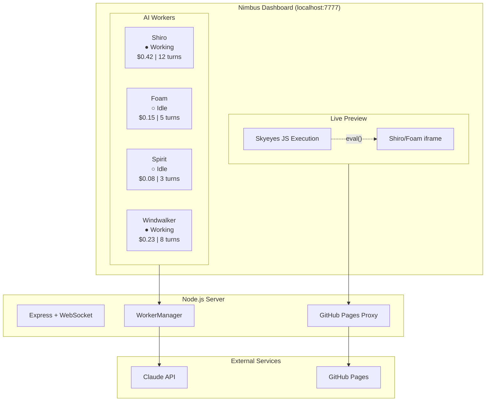
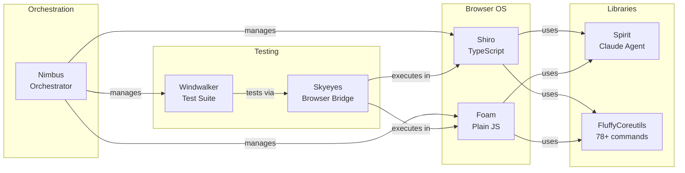

# Nimbus - AI Agent Orchestration Platform

Multi-worker Claude Code orchestration with live browser previews, real-time monitoring, and remote JavaScript execution.

**Dashboard:** `http://localhost:7777`

## What Is This?

Nimbus manages multiple Claude Code agents working on different repositories simultaneously. A web dashboard shows real-time status, logs, and live previews of browser-based projects (like Shiro and Foam). You can execute JavaScript directly in running browser apps via the Skyeyes bridge.



## Features

### Multi-Agent Management
- **7 concurrent workers**: shiro, foam, spirit, windwalker, fluffycoreutils, nimbus, skyeyes
- **Real-time status**: Idle, working, error, interrupted
- **Cost tracking**: Token usage and dollar amounts per worker
- **Turn counting**: Track conversation length
- **Stop/interrupt**: Cancel runaway agents instantly

### Live Browser Previews
- **Embedded iframes**: See Shiro and Foam running live
- **GitHub Pages proxy**: Loads live deployed versions with Skyeyes injected
- **Reload controls**: Refresh previews without reloading dashboard

### Skyeyes Integration
Execute JavaScript directly in live browser apps:

```bash
# Via REST API
curl -X POST http://localhost:7777/api/skyeyes/shiro-shiro/exec \
  -H "Content-Type: application/json" \
  -d '{"code":"__shiro.shell.exec(\"ls -la\")"}'

# Simple eval (no JSON escaping)
curl "http://localhost:7777/api/skyeyes/shiro-shiro/eval?code=document.title"

# Check connected bridges
curl http://localhost:7777/api/skyeyes/status
```

**Use cases:**
- Run shell commands in browser OS
- Inspect filesystem state
- Test new features without manual interaction
- Automated testing via Windwalker

### Real-Time Dashboard
- **WebSocket updates**: Instant log streaming
- **Color-coded status**: Green (idle), orange (working), red (error)
- **Draft persistence**: Message drafts saved to localStorage
- **Dark theme**: Optimized for long sessions

### Priority Tracking
- **Top 5 priorities**: At-a-glance task overview
- **Status indicators**: Active, pending, blocked, completed
- **Progress bars**: Visual completion tracking
- **Hover details**: Expand for full context

## Architecture

```
nimbus/
├── src/
│   ├── server/
│   │   ├── index.ts      # Express + WebSocket server
│   │   ├── routes.ts     # REST API, GitHub Pages proxy, Skyeyes
│   │   └── ws.ts         # WebSocket hub (dashboard + skyeyes bridges)
│   ├── workers/
│   │   ├── WorkerManager.ts  # Spawns and manages workers
│   │   ├── Worker.ts         # Claude Agent SDK wrapper
│   │   └── types.ts          # Shared interfaces
│   └── client/
│       ├── index.html    # Dashboard SPA
│       ├── app.ts        # Client logic
│       └── style.css     # Dark theme styling
├── scripts/
│   ├── build-static.js   # Build standalone Shiro/Foam HTML
│   └── setup.sh          # Clone all repos
├── dist/
│   ├── shiro.html        # Standalone Shiro (single file, works offline)
│   └── foam.html         # Standalone Foam (single file, works offline)
└── nimbus.config.json    # Configuration
```

## Quick Start

```bash
# Clone and setup
git clone https://github.com/williamsharkey/nimbus
cd nimbus
npm install
npm run setup   # Clone all related repos

# Start dashboard
npm start       # http://localhost:7777

# Development mode (auto-reload)
npm run dev
```

## Configuration

`nimbus.config.json`:
```json
{
  "port": 7777,
  "basePath": "~/Desktop/nimbus-land",
  "defaultModel": "claude-sonnet-4-5-20250929",
  "maxBudgetPerWorkerUsd": 5.0,
  "repos": [
    {
      "name": "shiro",
      "githubUser": "williamsharkey",
      "liveUrl": "https://williamsharkey.github.io/shiro/"
    },
    {
      "name": "foam",
      "githubUser": "williamsharkey",
      "liveUrl": "https://williamsharkey.github.io/foam/"
    }
  ]
}
```

## API Reference

### Workers
| Endpoint | Method | Description |
|----------|--------|-------------|
| `/api/workers` | GET | List all worker states |
| `/api/workers/:id/send` | POST | Send message to worker |
| `/api/workers/:id/interrupt` | POST | Stop a worker |

### Skyeyes
| Endpoint | Method | Description |
|----------|--------|-------------|
| `/api/skyeyes/:page/exec` | POST | Execute JS (JSON body) |
| `/api/skyeyes/:page/eval` | GET | Execute JS (query param) |
| `/api/skyeyes/:page/reload` | POST | Reload iframe |
| `/api/skyeyes/status` | GET | Check connected bridges |

### Live Pages
| Endpoint | Method | Description |
|----------|--------|-------------|
| `/live/:page` | GET | GitHub Pages proxy with Skyeyes |
| `/proxy?url=` | GET | Generic URL proxy |

## Standalone Builds

Generate single-file HTML versions of Shiro and Foam:

```bash
node scripts/build-static.js
# Creates:
#   dist/shiro.html  (works offline, file:// protocol)
#   dist/foam.html   (works offline, file:// protocol)
```

These are complete, self-contained browser OS environments in a single HTML file.

## WebSocket Protocol

### Client → Server
```javascript
// Send message to specific worker
{ type: 'send_to_worker', workerId: 'shiro', message: 'fix the bug' }

// Interrupt worker
{ type: 'interrupt_worker', workerId: 'shiro' }

// Execute JS in live page
{ type: 'skyeyes_exec', page: 'shiro-shiro', code: '__shiro.shell.exec("ls")' }
```

### Server → Client
```javascript
// Worker state update
{ type: 'worker_update', worker: { id: 'shiro', status: 'working', ... } }

// Log entry
{ type: 'worker_log', workerId: 'shiro', log: 'Building...' }

// Skyeyes result
{ type: 'skyeyes_result', page: 'shiro-shiro', result: {...} }
```

## Related Projects

This is the orchestration layer for the nimbus-land ecosystem:



- **[Shiro](https://github.com/williamsharkey/shiro)** - TypeScript browser OS with 78+ commands, npm, git, vi/nano
- **[Foam](https://github.com/williamsharkey/foam)** - Plain JS browser OS, zero build step
- **[Spirit](https://github.com/williamsharkey/spirit)** - Claude Code agent library
- **[Windwalker](https://github.com/williamsharkey/windwalker)** - Test automation (linkedom + skyeyes)
- **[FluffyCoreutils](https://github.com/williamsharkey/fluffycoreutils)** - Shared Unix commands
- **[Skyeyes](https://github.com/williamsharkey/skyeyes)** - Browser-side bridge for remote JS execution

## Tech Stack

- **Backend**: Node.js, Express, WebSocket (ws)
- **Frontend**: TypeScript, Vanilla JS
- **AI**: Anthropic Claude Agent SDK
- **Build**: esbuild, TypeScript

## License

MIT
